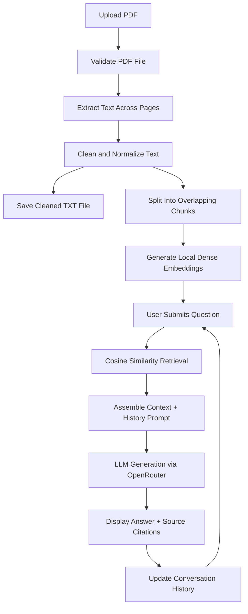

# Project 08: AI PDF Research Assistant

A Streamlit-based AI research assistant that unifies PDF text extraction, document cleaning, persistent export, semantic document retrieval, grounded question answering, and multi-turn conversational memory into one cohesive application.

---

## 1. Project Overview

The AI PDF Research Assistant consolidates three previously distinct workflows:
1. **PDF Text Extraction and Cleaning**: Extract text across multi-page PDF documents, clean formatting noise, and export normalized text as `.txt`.
2. **Document-Grounded Q&A**: Segment documents into overlapping contextual chunks, compute local semantic embeddings, and answer queries strictly grounded in document contents.
3. **Conversational Assistant**: Maintain multi-turn dialog history so follow-up queries naturally resolve pronouns and build upon previous answers without losing document context.

---

## 2. Problem It Solves

Dense technical papers, legal filings, financial statements, and clinical studies are difficult to digest quickly. Traditional approaches present specific pitfalls:
- Manual reading and keyword searching (`Ctrl+F`) fail on conceptual questions or paraphrased language.
- Generic LLM chat interfaces suffer from hallucinations when answering questions about niche or domain-specific documents because they lack grounded source context.
- Ad-hoc scripts often separate text extraction from exploration, forcing users to juggle separate command-line tools, text files, and chat prompts.

This project solves these issues by automating the end-to-end pipeline in a single local workspace: upload a PDF, extract and export clean text, and interact conversationally with grounded citations.

---

## 3. Features

- **Robust PDF Processing**: Uses `pypdf` with header validation (`%PDF`), page counting, empty-page detection, and graceful error handling for unreadable files.
- **Noise-Free Text Cleaning**: Normalizes linebreaks, de-hyphenates words split across lines, removes repetitive whitespace, and standardizes paragraph breaks.
- **State-of-the-Art Semantic Retrieval**: Embeds document chunks using `openai/text-embedding-3-small` (1536 dimensions) via OpenRouter, with options for `baai/bge-large-en-v1.5` and local fallback. Cosine similarity ranking ensures precise context retrieval.
- **Strict Grounding Guardrails**: Prompt engineering directs the LLM to answer solely using supplied excerpts. If information is absent, the system explicitly reports that the document does not contain the answer.
- **Multi-Turn Contextual Memory**: Tracks the conversation in Streamlit session state, feeding previous user questions and assistant answers to the LLM for coherent follow-ups.
- **Interactive Streamlit Interface**: Clean, minimal layout featuring document status metrics, source chunk expanders with similarity scores, and conversation reset.

---

## 4. Application Flow

The application executes the following sequence:

1. **PDF Upload**: User uploads a document via the sidebar or main dropzone.
2. **Validation**: Checks file signature, structure, and page readability.
3. **Text Extraction**: Iterates over document pages, aggregating textual content.
4. **Text Cleaning**: Cleans whitespace, joins split hyphens, and formats readable paragraphs.
5. **TXT Export**: Saves extracted text to `data/extracted/<filename>.txt` and prepares the browser download payload.
6. **Document Preparation**: Chunks cleaned text into 350-word windows with 50-word sliding overlaps to preserve semantic continuity.
7. **Semantic Indexing**: Computes 1536-dimensional dense vector embeddings for all chunks.
8. **User Query**: User submits a question through the chat interface.
9. **Context Retrieval**: Computes query embedding, calculates cosine similarity against document chunks, and retrieves the top-k matches.
10. **Grounded Generation**: Combines system guardrails, recent conversation history, retrieved excerpts, and user prompt to query OpenRouter.
11. **Conversation Update**: Displays the assistant response, cites retrieved sources, and stores the turn in session state for future follow-up queries.

---

## 5. Visual Flowchart



---

## 6. Architecture

```text
project-08-ai-pdf-research-assistant/
│
├── app.py                      # Streamlit UI orchestration and session state
├── requirements.txt            # Project dependencies
├── README.md                   # Complete project documentation
├── .env.example                # Template for environment configuration
├── .gitignore                  # Ignores secrets, cache, and uploads
│
├── .streamlit/
│   └── config.toml             # Streamlit configuration
│
├── src/
│   ├── __init__.py             # Package initializer
│   ├── pdf_processor.py        # PDF validation, page counting, and extraction
│   ├── text_cleaner.py         # Whitespace normalization and de-hyphenation
│   ├── document_processor.py   # Sliding-window chunking and file saving
│   ├── retriever.py            # Local Transformer embeddings and similarity search
│   ├── conversation.py         # Multi-turn history manager and prompt formatting
│   └── llm.py                  # OpenRouter API client with strict grounding prompt
│
└── data/
    ├── uploads/                # Directory for uploaded PDF documents
    └── extracted/              # Directory for generated .txt files
```

### Component Responsibilities

- **`pdf_processor.py`**: Interacts with `pypdf.PdfReader` to extract raw strings per page and check for blank or scanned documents.
- **`text_cleaner.py`**: Applies regex patterns to eliminate non-standard whitespace, line wraps, and ligature noise.
- **`document_processor.py`**: Partitions text into structured chunk objects carrying page metadata, index offsets, and word counts.
- **`retriever.py`**: Wraps `AutoTokenizer` and `AutoModel` for `sentence-transformers/all-MiniLM-L6-v2`. Computes embeddings locally with PyTorch mean pooling and cosine similarity ranking.
- **`conversation.py`**: Encapsulates conversation state, message history pruning, and multi-turn prompt construction.
- **`llm.py`**: Configures the OpenAI client pointed at OpenRouter endpoints, enforcing grounding rules in the system prompt.
- **`app.py`**: Orchestrates UI rendering, file upload triggers, session state caching, and chat message display.

---

## 7. Technologies Used

- **Streamlit**: Python web framework for reactive UI components, session state, and file download management.
- **pypdf**: Lightweight, pure-Python library for reading PDF structures and extracting textual streams.
- **PyTorch & HuggingFace Transformers**: Local execution of `all-MiniLM-L6-v2` dense embedding models for zero-cost semantic search without external embedding APIs.
- **OpenRouter API (`openai` client)**: Provides access to modern LLMs (e.g., `nvidia/nemotron-3.5-lightning:free`, `meta-llama/llama-3.3-70b-instruct`) with streaming and structured completions.
- **python-dotenv**: Reads workspace environment variables from `.env` files without hardcoding credentials.

---

## 8. Setup

### 1. Environment Activation
Use the shared workspace root virtual environment:

```powershell
# In workspace root
.\.venv\Scripts\Activate.ps1
```

### 2. Dependency Installation
Install project dependencies if not already satisfied in the root environment:

```powershell
cd project-08-ai-pdf-research-assistant
pip install -r requirements.txt
```

### 3. API Key Configuration
Configure your OpenRouter API key using either method:

**Option A**: Create a `.env` file in the project folder:
```bash
OPENROUTER_API_KEY=your_actual_openrouter_api_key_here
```

**Option B**: Enter the key directly into the application sidebar at runtime.

---

## 9. Running the Application

Launch the Streamlit app from the workspace root or project directory:

```powershell
# From workspace root
.\.venv\Scripts\streamlit.exe run project-08-ai-pdf-research-assistant/app.py --server.port 8503
```

Navigate to `http://localhost:8503` in your web browser.

---

## 10. Example Usage

### Step 1: Upload Document
Upload a research paper or report, such as `attention_is_all_you_need.pdf`.

### Step 2: Inspection and Export
The sidebar displays:
- Document: `attention_is_all_you_need.pdf`
- Pages: `15`
- Extracted Words: `8,420`
- Extracted Chunks: `28`
- Button: `Download Extracted Text (.txt)`

### Step 3: Conversational Inquiries

**Turn 1**
- **User**: What is the primary architecture proposed in this document?
- **AI**: The document proposes the Transformer architecture, which relies entirely on self-attention mechanisms without recurrent or convolutional neural networks.
- *(Sources Expander: Excerpt from Chunk 1, Page 1, Similarity 0.82)*

**Turn 2 (Follow-up)**
- **User**: Why did the authors choose to avoid recurrence?
- **AI**: The authors avoided recurrence to allow for significantly more parallelization during training and to eliminate sequential computation constraints inherent in RNNs and LSTMs.
- *(Sources Expander: Excerpt from Chunk 3, Page 2, Similarity 0.79)*

**Turn 3 (Out of Scope)**
- **User**: What is the capital of Australia?
- **AI**: The provided document does not contain information about the capital of Australia.

---

## 11. What I Learned

Through building this project, several foundational GenAI engineering concepts were mastered:

1. **PDF Internals and Extraction Limits**: PDFs are visual layout descriptions rather than structured text files. Handling page boundaries, whitespace, and scanned documents requires disciplined validation before downstream processing.
2. **Text Normalization for LLMs**: Removing carriage returns, de-hyphenating line breaks, and eliminating extraneous whitespaces substantially improves embedding accuracy and prevents garbage-in-garbage-out retrieval.
3. **Sliding-Window Chunking**: Chunk size and overlap determine retrieval precision. A 350-word chunk with a 50-word overlap balances semantic completeness with granular precision.
4. **Dense Embeddings and Vector Search**: Understanding how transformer representations map sentences to high-dimensional geometry and using cosine similarity to rank relevance without a heavy database.
5. **Grounded Generation**: How to prevent model hallucinations using explicit system constraints, prompt templates, and context injection.
6. **Conversational Context Management**: Retaining past dialogue turns in working memory so that follow-up questions can be interpreted in context.
7. **Clean Streamlit Orchestration**: Managing stateful workflows across file upload, processing, vector indexing, and user interactions without triggering accidental page reruns.
